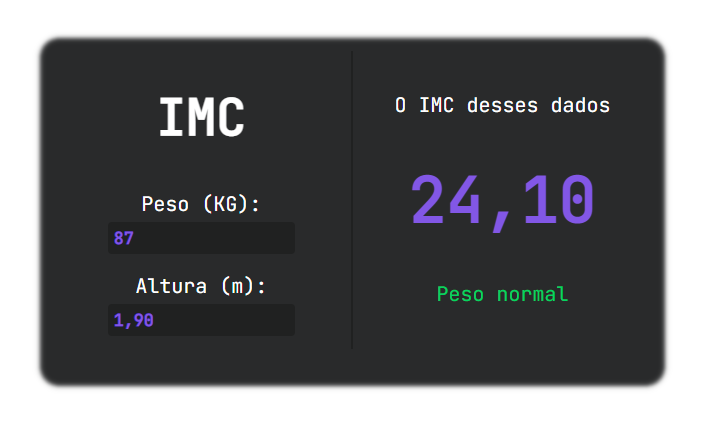

<h1 align="center">
  
  Bem Vindo ao Imc Dark
</h1>
<p align="center">➗🔢 A aplicação foi desenvolvida para calcular o IMC de uma pessoa a partir de sua altura e peso e classificá-lo de acordo com a tabela de IMC da Organização Mundial da Saúde (OMS).</p>

<div align="center">



</div>

<p align="center">
  
  <a href="#" target="_blank">
    
  </a>
  <a href="http://teste.netlify.app/doc" target="_blank">
    
  </a>
  <a href="https://twitter.com/Wesley_AllanS" target="_blank">
    
  </a>
</p>

### ✨ [Deployment 1](https://imcdark.netlify.app)

### ✨ [Deployment 2](https://wesleyallan.github.io/imc-dark/)

<br />

## 📨 Instalar

Projeto simples com HTML e CSS puro, ou seja, assim não havendo necessidade de instalações extras.

```sh
git clone https://github.com/wesleyallan/imc-dark
```

## ⚙️ Executar

Para a execução do projeto basta haver um browser instalado, e abrir o arquivo `index.html`, seja por linha de comando ou pelo atalho `Ctrl + O` com o browser aberto.

```sh
cd imc-dark
[browser] index.html
```

## 😎 Usar

Para usar a aplicação, basta fornecer sua altura e peso na interface da aplicação. Em seguida, a aplicação exibirá o seu IMC e a classificação de acordo com a tabela da OMS.

A classificação do IMC é a seguinte:

| IMC               | Situação       |
| ----------------- | -------------- |
| Menor que 18.5    | Abaixo do peso |
| Entre 18.5 e 24.9 | Peso normal    |
| Entre 25 e 29.9   | Sobrepeso      |
| Maior que 30      | Obesidade      |

## Autor

👤 **Wesley Silva**

- Website: [wesleyallan.dev](https://wesleyallan.dev)
- Twitter: [@Wesley_AllanS](https://twitter.com/Wesley_AllanS)
- Github: [@wesleyallan](https://github.com/wesleyallan)
- LinkedIn: [@wesleyallan](https://linkedin.com/in/wesleyallan)

## Mostre seu apoio

Dê um ⭐️ se esse projeto te ajudou!
